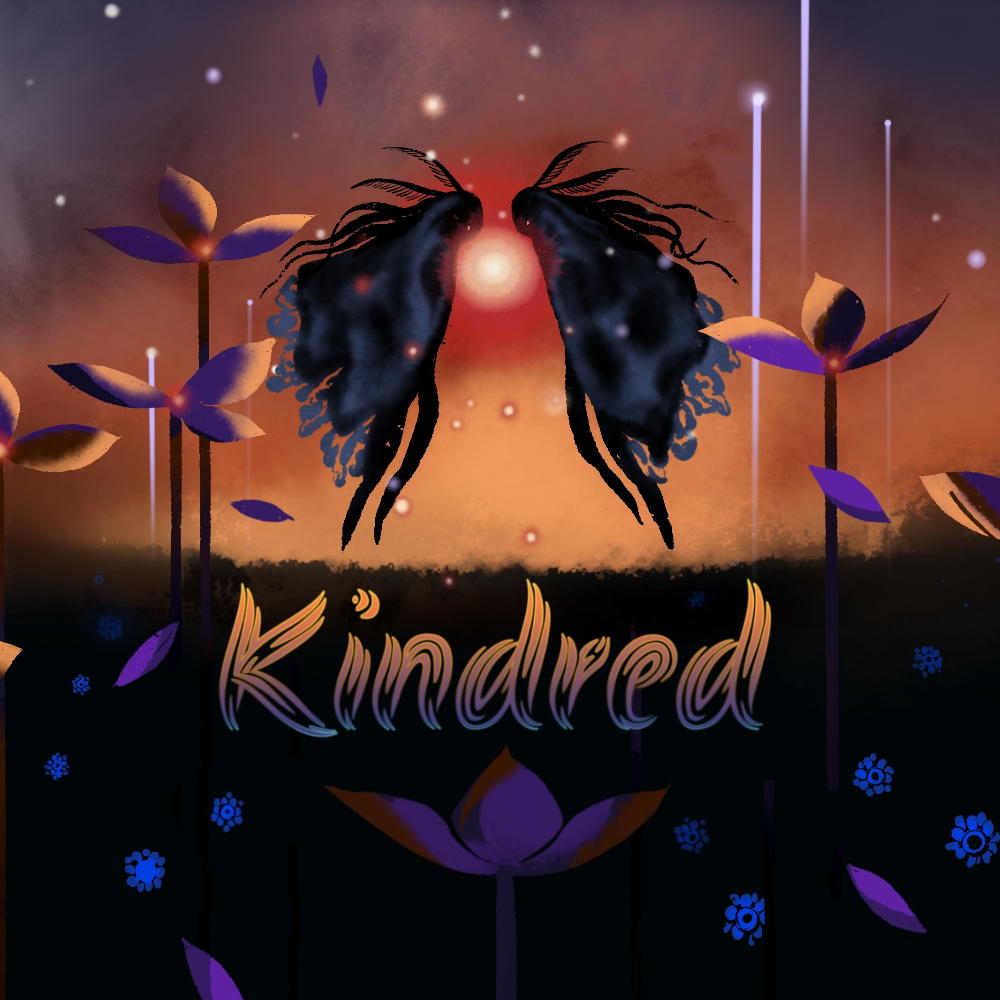

Original Composition and Sound Design for an Embodied Narrative VR experience developed during Oculus Launchpad 2021

<iframe width="100%" height="450" scrolling="no" frameborder="no" allow="autoplay" src="https://w.soundcloud.com/player/?url=https%3A//api.soundcloud.com/tracks/1356657850&color=%23ff5500&auto_play=false&hide_related=false&show_comments=true&show_user=true&show_reposts=false&show_teaser=true&visual=true"></iframe>

"We wander aimless and lost, into the depth of a storm, discover the warmth of a stranger, find refuge in a moment of serendipity, and transcend together, to be left drifting aloft in the clouds."

<iframe src="https://drive.google.com/file/d/1-Gt7vwbSapFx0MSqCLJlFWneJ8N1HdNU/preview" width="640" height="480" allow="autoplay"></iframe>

